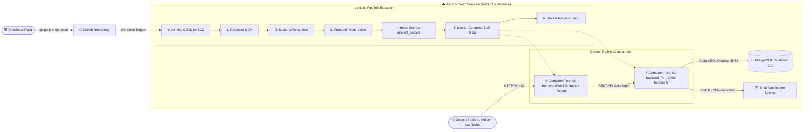
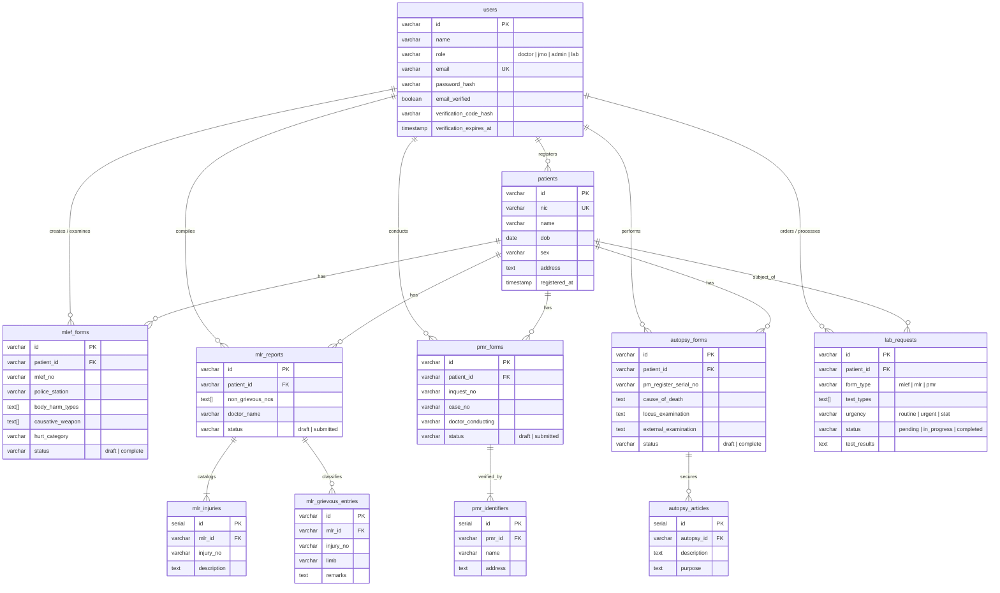

<p align="center">
  <a href="#forensic-medical-records-management-system">
    
  </a>
</p>

<h1 align="center">Forensic Medical Records Management System</h1>

<p align="center">
  <strong>CO2050 — Database Systems Module Project</strong><br />
  Department of Computer Engineering | Faculty of Engineering | University of Peradeniya
</p>

<p align="center">
  <em>Designed and engineered by <strong>Team Mythix</strong> (Group 03)</em>
</p>

<p align="center">
  <a href="./Group03_Report.pdf"></a>
  <a href="#cloud-architecture--devops-pipeline"></a>
  <a href="#cloud-architecture--devops-pipeline"></a>
  <a href="#cloud-architecture--devops-pipeline"></a>
</p>

<p align="center">
  <a href="#technologies-used"></a>
  <a href="#technologies-used"></a>
  <a href="#technologies-used"></a>
  <a href="#technologies-used"></a>
  <a href="#technologies-used"></a>
  <a href="#technologies-used"></a>
  <a href="#testing--quality-assurance"></a>
  <a href="#testing--quality-assurance"></a>
</p>

---

## 📑 Quick Navigation

- [📄 Project Report & Documentation](#-project-report--documentation)
- [📌 Executive Overview](#-executive-overview)
- [🛠️ Technology Stack](#️-technology-stack)
- [☁️ Cloud Architecture & DevOps Pipeline](#️-cloud-architecture--devops-pipeline)
- [🏛️ Database Architecture & Relational Design](#️-database-architecture--relational-design)
- [👥 Role-Based Access Control (RBAC)](#-role-based-access-control-rbac)
- [📋 Medico-Legal Form Pipelines](#-medico-legal-form-pipelines)
- [🚀 Quick Start & Deployment Guide](#-quick-start--deployment-guide)
- [🧪 Testing & Quality Assurance](#-testing--quality-assurance)
- [🔐 Pre-Seeded Test Accounts](#-pre-seeded-test-accounts)
- [👥 Team Mythix](#-team-mythix-group-03)

---

## 📄 Project Report & Documentation

The official academic report for this project is available in this repository:

> 📘 **[Download Group 03 Project Report (Group03_Report.pdf)](./Group03_Report.pdf)**
> 
> *Comprehensive 60+ page submission detailing domain problem analysis, relational database schema normalization (3NF/BCNF), entity relationship diagrams, query optimization, indexing benchmarks, system security policies, and deployment logs.*

- **UI/UX Prototype**: [Figma Design File](https://www.figma.com/design/ocMZgrr7VfgLWN6aYm8OC2/Forensic-Medical-System-Design)
- **Source Repository**: [GitHub - saninduhansara/Forensic-Medical-Project](https://github.com/saninduhansara/Forensic-Medical-Project)

---

## 📌 Executive Overview

In Sri Lanka's healthcare and judicial ecosystem, forensic medical records (MLEF, MLR, PMR, and Autopsy reports) have traditionally relied on handwritten paperwork, physical registries, and fragmented departmental archives. This introduces critical vulnerabilities: loss or degradation of sensitive evidence, slow turnaround times for court trials, unauthorized record manipulation, and delayed laboratory specimen analysis.

Developed for the **CO2050 Database Systems** module at the **University of Peradeniya**, the **Forensic Medical Records Management System** transforms this workflow into an enterprise-grade, paperless, tamper-evident digital platform.

### Core Objectives:
1. **Relational Integrity & Legal Compliance**: Strict adherence to relational database constraints, cascading integrity, and foreign-key validation reflecting Sri Lankan legal procedures.
2. **Chain of Custody & Tamper Evidence**: End-to-end auditable trails for evidence collected during post-mortems, autopsy dissection notes, and specimen routing.
3. **Role-Based Security**: Cryptographically secure separation of duties between Police Officers, Medical Officers (MO), Judicial Medical Officers (JMO), and Forensic Lab Technicians.
4. **Court-Ready Document Automation**: Automated, instantaneous generation of standardized, formatted legal PDF reports containing SLMC registration details, hospital seals, and chronological injury maps.
5. **Modern Cloud Native Operations**: Containerized via **Docker**, automated via **Jenkins CI/CD**, and deployed live on **AWS EC2**.

---

## 🛠️ Technology Stack

The project adopts the modern **PERN Stack** (PostgreSQL, Express, React, Node.js) paired with cloud DevOps tools to deliver speed, reliability, and security:

### 🌟 Core PERN & Cloud DevOps Infrastructure

<div align="center">
  <table>
    <tr>
      <td align="center" width="14%">
        <a href="https://www.postgresql.org/">
          
        </a><br />
        <strong>PostgreSQL</strong><br />
        <sub>v15+ Relational DB</sub>
      </td>
      <td align="center" width="14%">
        <a href="https://expressjs.com/">
          
        </a><br />
        <strong>Express.js</strong><br />
        <sub>v5.x REST API</sub>
      </td>
      <td align="center" width="14%">
        <a href="https://react.dev/">
          
        </a><br />
        <strong>React 18</strong><br />
        <sub>SPA Frontend</sub>
      </td>
      <td align="center" width="14%">
        <a href="https://nodejs.org/">
          
        </a><br />
        <strong>Node.js</strong><br />
        <sub>v18+ Runtime</sub>
      </td>
      <td align="center" width="14%">
        <a href="https://www.docker.com/">
          
        </a><br />
        <strong>Docker</strong><br />
        <sub>Container Engine</sub>
      </td>
      <td align="center" width="14%">
        <a href="https://www.jenkins.io/">
          
        </a><br />
        <strong>Jenkins</strong><br />
        <sub>CI/CD Pipeline</sub>
      </td>
      <td align="center" width="14%">
        <a href="https://aws.amazon.com/ec2/">
          
        </a><br />
        <strong>AWS EC2</strong><br />
        <sub>Cloud Deployment</sub>
      </td>
    </tr>
  </table>
</div>

### 🎨 Frontend Ecosystem & Testing Tools

<div align="center">
  <table>
    <tr>
      <td align="center" width="16%">
        <a href="https://www.typescriptlang.org/">
          
        </a><br />
        <strong>TypeScript</strong><br />
        <sub>Type Safety</sub>
      </td>
      <td align="center" width="16%">
        <a href="https://tailwindcss.com/">
          
        </a><br />
        <strong>Tailwind CSS</strong><br />
        <sub>v4 Utility Styling</sub>
      </td>
      <td align="center" width="16%">
        <a href="https://vitejs.dev/">
          
        </a><br />
        <strong>Vite</strong><br />
        <sub>Bundler & Dev</sub>
      </td>
      <td align="center" width="16%">
        <a href="https://jestjs.io/">
          
        </a><br />
        <strong>Jest</strong><br />
        <sub>API Testing</sub>
      </td>
      <td align="center" width="16%">
        <a href="https://nginx.org/">
          
        </a><br />
        <strong>Nginx</strong><br />
        <sub>Web Reverse Proxy</sub>
      </td>
    </tr>
  </table>
</div>

### Architectural Roles:
- **PostgreSQL 15+**: Primary relational engine storing users, examinees, legal forms, and autopsy findings. Utilizes B-Tree indexing, array types (`TEXT[]`), and foreign key cascade rules.
- **Node.js & Express 5 (ES Modules)**: High-throughput REST API with centralized error boundaries, recursive request sanitization, connection pooling (`pg.Pool`), and JWT auth guards.
- **React 18 & TypeScript 5**: Component-driven Single Page Application (SPA) powered by Vite, Tailwind CSS v4, Lucide icons, and interactive form validations.
- **Docker & Docker Compose**: Multi-container setup isolating the `forensic-frontend` (Nginx) and `forensic-backend` (Node.js) on a private bridge network.
- **Jenkins CI/CD**: Automated integration testing (Jest + Vitest) and zero-downtime container rolling deployments on every git push.
- **AWS EC2 (Ubuntu Linux)**: Production host running Docker Engine with hardened security groups and persistent volume management.

---

## ☁️ Cloud Architecture & DevOps Pipeline

The application is hosted on an **AWS EC2** instance with an automated continuous integration and continuous deployment pipeline managed by **Jenkins** and **Docker Compose**.

### System Architecture Flow

<p align="center">
  
</p>

### End-to-End Delivery Lifecycle:



### Key DevOps & Cloud Engineering Highlights:

1. **Webhook-Triggered CI/CD**: Pushes to `main` instantly trigger the `Jenkinsfile` pipeline on the AWS EC2 instance.
2. **Automated Quality Gates**:
   - Backend tests run across 7 suites with **Jest** and **Supertest**.
   - Frontend tests run with **Vitest** and **React Testing Library**.
   - Builds abort immediately if any test fails, keeping production safe.
3. **Secret Decoupling**: Database connection strings, SMTP credentials, and JWT secret keys reside strictly outside version control in `/var/lib/jenkins/project_secrets/` on the EC2 host and are injected during build time.
4. **Zero-Downtime Deployment**: Executed via `docker compose build --no-cache` and `docker compose up -d --remove-orphans`.
5. **Storage Safeguard**: Jenkins automatically runs `docker image prune -af` post-deployment, guaranteeing the EC2 instance's 30GB disk volume never fills up.

---

## 🏛️ Database Architecture & Relational Design

The database schema (`schema.sql`) adheres to **3NF/BCNF** standards to eliminate anomaly risks while accommodating complex forensic workflows.

### Entity-Relationship Diagram (ERD)



### Relational Schema Highlights:
- **Foreign Key Cascades**: Child entities (`mlr_injuries`, `mlr_grievous_entries`, `pmr_identifiers`, `autopsy_articles`) maintain referential integrity via `ON DELETE CASCADE`.
- **PostgreSQL Native Arrays**: Employed for multi-select legal fields (`body_harm_types`, `causative_weapon`, `sexual_assault_signs`, `test_types`) to preserve normalized representation without unnecessary junction table overhead.
- **B-Tree Query Optimization**: Secondary performance indexes are automatically created at backend startup to eliminate sequential scans on frequent joins:
  ```sql
  CREATE INDEX IF NOT EXISTS idx_mlef_forms_patient_id ON mlef_forms(patient_id);
  CREATE INDEX IF NOT EXISTS idx_mlr_reports_patient_id ON mlr_reports(patient_id);
  CREATE INDEX IF NOT EXISTS idx_pmr_forms_patient_id ON pmr_forms(patient_id);
  CREATE INDEX IF NOT EXISTS idx_autopsy_forms_patient_id ON autopsy_forms(patient_id);
  CREATE INDEX IF NOT EXISTS idx_lab_requests_patient_id ON lab_requests(patient_id);
  ```

---

## 👥 Role-Based Access Control (RBAC)

The system implements strict separation of concerns through 4 dedicated roles:

| Role | Badge | Permissions & System Scope |
| :--- | :---: | :--- |
| **Medical Officer (MO / Doctor)** | `doctor` | Examines live clinical examinees, completes **Part B of MLEF**, drafts and submits **MLR reports**, tracks injury classifications, and orders forensic lab investigations. |
| **Judicial Medical Officer (JMO)** | `jmo` | Oversees death investigations, conducts post-mortem inquests (**PMR**), performs comprehensive anatomical **Autopsy examinations**, records causes of death, and logs evidentiary articles. |
| **Police Officer / Hospital Clerk** | `admin` | Registers new examinees and patients, records basic demographics and National Identity Cards (NIC), issues **Part A of MLEF**, and manages staff accounts. |
| **Forensic Lab Technician** | `lab` | Manages diagnostic queues, accepts specimen orders (**Toxicology**, **Blood Alcohol Content**, **Drug Screening**), updates specimen processing states, and certifies forensic findings. |

---

## 📋 Medico-Legal Form Pipelines

```
 ┌─────────────────┐       ┌────────────────────────┐       ┌──────────────────────┐
 │  Police Intake  │ ───►  │  Clinical Examination  │ ───►  │  Legal Certification │
 │  (MLEF Part A)  │       │  (MLEF Part B / MLR)   │       │  (Court-Ready PDF)   │
 └─────────────────┘       └────────────────────────┘       └──────────────────────┘
                                       │
                                       ▼
                           ┌────────────────────────┐
                           │   Lab Investigation    │
                           │ (Routine/Urgent/STAT)  │
                           └────────────────────────┘
```

1. **MLEF (Medico-Legal Examination Form)**: Two-stage clinical intake. Part A records police requisition and alleged assault history; Part B records clinical harm, weapon correlation, alcohol/narcotic influence, and life danger status.
2. **MLR (Medico-Legal Report)**: Comprehensive legal injury report. Distinctly catalogs non-grievous vs. grievous injuries according to the Sri Lankan Penal Code.
3. **PMR (Post-Mortem Report)**: Magistrate court inquest documentation with body identification witnesses and external post-mortem examination.
4. **Detailed Autopsy Form**: Full systemic anatomical dissection form covering cranial, thoracic, abdominal, cardiovascular, and skeletal structures, including evidentiary articles secured for criminal trials.
5. **Forensic Lab Requests**: Diagnostic ordering pipeline categorized by urgency (`routine`, `urgent`, `stat`) with real-time feedback into clinical records.

---

## 🚀 Quick Start & Deployment Guide

### Prerequisites
- **Docker** & **Docker Compose** installed (or **Node.js 18+** & **PostgreSQL 15+** for bare-metal setup).
- Git.

---

### Option 1: Docker Compose Deployment (Recommended)

To run the entire multi-container production stack:

1. **Clone the repository**:
   ```bash
   git clone https://github.com/saninduhansara/Forensic-Medical-Project.git
   cd Forensic-Medical-Project
   ```

2. **Configure environment variables**:
   ```bash
   cp backend/.env.example backend/.env
   ```
   *Edit `backend/.env` with your PostgreSQL connection string and JWT secret.*

3. **Launch with Docker Compose**:
   ```bash
   docker compose up -d --build
   ```

4. **Access the application**:
   - **Frontend UI**: `http://localhost` (Port 80)
   - **Backend API**: `http://localhost:3000/api` (Port 3000)

To stop the containers:
```bash
docker compose down
```

---

### Option 2: Local Development Setup

#### 1. Backend Setup:
```bash
cd backend
npm install

# Initialize database schema & seed initial demo data
npm run db:init
npm run db:seed

# Start backend in development mode with nodemon
npm start
```

#### 2. Frontend Setup:
```bash
cd ../frontend
npm install

# Start Vite development server
npm run dev
```
*Frontend runs on `http://localhost:5173`.*

---

## 🧪 Testing & Quality Assurance

Both the backend and frontend are guarded by rigorous test suites integrated into the Jenkins CI/CD pipeline:

```bash
# Run Backend Integration Tests (Jest + Supertest)
cd backend
npm test

# Run Frontend Component Tests (Vitest + React Testing Library)
cd ../frontend
npm test
```

### Test Coverage Highlights:
- **Backend**: Complete coverage of authentication (login, JWT verification, password reset, 2FA code hashing), input sanitization, and CRUD operations across all 7 route modules (`auth`, `patients`, `mlef`, `mlr`, `pmr`, `autopsy`, `lab`).
- **Frontend**: Tests for UI badge rendering, form validation sections, input error handling, read-only view state protections, and PDF generator output structures.

---

## 🔐 Pre-Seeded Test Accounts

When the database is seeded using `npm run db:seed`, the following accounts are pre-configured and pre-verified:

| Role | Name | Email | Password |
| :--- | :--- | :--- | :--- |
| **Doctor / MO** | Dr. Amal Perera | `dr.perera@forensic.gov` | `Doctor@123` |
| **Doctor / MO** | Dr. Saman Fernando | `dr.fernando@forensic.gov` | `Doctor@456` |
| **JMO** | Dr. Ruwan Perera | `dr.ruwan@forensic.gov` | `Jmo@123` |
| **Admin / Police** | Nimal Silva | `nimal.silva@forensic.gov` | `Admin@123` |
| **Admin / Police** | Kamani Dissanayake | `kamani.d@forensic.gov` | `Admin@456` |
| **Lab Tech** | Chaminda Wickramasinghe | `chaminda.w@forensic.gov` | `Lab@123` |
| **Lab Tech** | Dilini Jayawardena | `dilini.j@forensic.gov` | `Lab@456` |

---

## 👥 Team Mythix (Group 03) — Contributors

Developed with pride for the **CO2050 Database Systems** module:
- **Department of Computer Engineering**, Faculty of Engineering
- **University of Peradeniya**, Sri Lanka

<div align="center">
  <table>
    <tr>
      <td align="center" width="25%">
        <br /><br />
        <strong>S.H.S. Hansara</strong><br />
        <code>E/22/130</code><br />
        <a href="mailto:e22130@eng.pdn.ac.lk">e22130@eng.pdn.ac.lk</a>
      </td>
      <td align="center" width="25%">
        <br /><br />
        <strong>T.H. Abeywickrama</strong><br />
        <code>E/22/008</code><br />
        <a href="mailto:e22008@eng.pdn.ac.lk">e22008@eng.pdn.ac.lk</a>
      </td>
      <td align="center" width="25%">
        <br /><br />
        <strong>H.P.J. Gunawardhana</strong><br />
        <code>E/22/126</code><br />
        <a href="mailto:e22126@eng.pdn.ac.lk">e22126@eng.pdn.ac.lk</a>
      </td>
      <td align="center" width="25%">
        <br /><br />
        <strong>H.T.D. Hatharasinghe</strong><br />
        <code>E/22/135</code><br />
        <a href="mailto:e22135@eng.pdn.ac.lk">e22135@eng.pdn.ac.lk</a>
      </td>
    </tr>
  </table>
</div>

### Repository & Artifacts:
- **Project Report**: [Group03_Report.pdf](./Group03_Report.pdf)
- **CI/CD Configuration**: [Jenkinsfile](./Jenkinsfile)
- **Container Definition**: [docker-compose.yml](./docker-compose.yml)
- **Database Schema**: [backend/schema.sql](./backend/schema.sql)

---

<p align="center">
  <sub>© 2026 Team Mythix — Built for academic evaluation under CO2050 Database Systems module.</sub>
</p>
