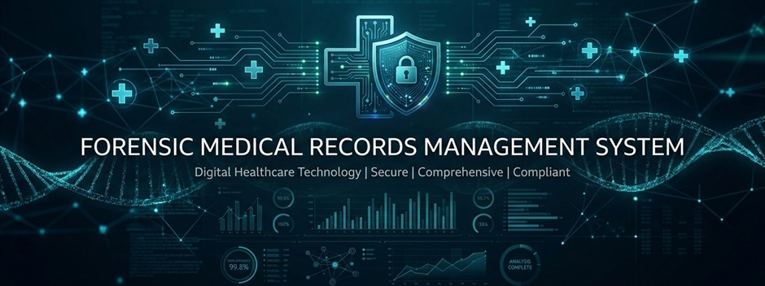
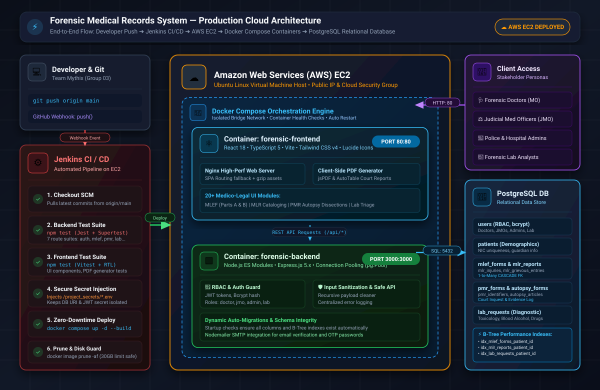

<p align="center">
  
</p>

# Forensic Medical Records Management System

<p align="center">
  <strong>CO2050 / CO226 — Database Systems Project</strong><br />
  Department of Computer Engineering | Faculty of Engineering | University of Peradeniya
</p>

<p align="center">
  <em>Designed and engineered by <strong>Team Mythix</strong> (Group 03)</em>
</p>

---



---

## 👥 Team

<div align="center">
  <table>
    <tr>
      <td align="center" width="25%">
        <br /><br />
        <strong>S.H.S. Hansara</strong><br />
        <code>E/22/130</code><br />
        <a href="mailto:e22130@eng.pdn.ac.lk">e22130@eng.pdn.ac.lk</a>
      </td>
      <td align="center" width="25%">
        <br /><br />
        <strong>T.H. Abeywickrama</strong><br />
        <code>E/22/008</code><br />
        <a href="mailto:e22008@eng.pdn.ac.lk">e22008@eng.pdn.ac.lk</a>
      </td>
      <td align="center" width="25%">
        <br /><br />
        <strong>H.P.J. Gunawardhana</strong><br />
        <code>E/22/126</code><br />
        <a href="mailto:e22126@eng.pdn.ac.lk">e22126@eng.pdn.ac.lk</a>
      </td>
      <td align="center" width="25%">
        <br /><br />
        <strong>H.T.D. Hatharasinghe</strong><br />
        <code>E/22/135</code><br />
        <a href="mailto:e22135@eng.pdn.ac.lk">e22135@eng.pdn.ac.lk</a>
      </td>
    </tr>
  </table>
</div>

---

## 📑 Table of Contents
1. [Introduction](#introduction)
2. [Problem Domain & Background](#problem-domain--background)
3. [Solution & Core Objectives](#solution--core-objectives)
4. [System Architecture](#system-architecture)
5. [Database Architecture & Relational Design](#database-architecture--relational-design)
6. [Role-Based Access Control (RBAC)](#role-based-access-control-rbac)
7. [Medico-Legal Form Pipelines](#medico-legal-form-pipelines)
8. [Technology Stack](#technology-stack)
9. [DevOps & Automated CI/CD Pipeline](#devops--automated-cicd-pipeline)
10. [Testing & Quality Assurance](#testing--quality-assurance)
11. [Links & Resources](#links)

---

## Introduction

In Sri Lanka's healthcare and judicial ecosystem, forensic medical records—including Medico-Legal Examination Forms (**MLEF**), Medico-Legal Reports (**MLR**), Post-Mortem Reports (**PMR**), and anatomical Autopsy reports—have traditionally depended on physical registries, manual paper documentation, and decentralized departmental archives.

The **Forensic Medical Records Management System** is an enterprise-grade, paperless, tamper-evident digital solution built specifically to transform this mission-critical workflow. Developed for the Database Systems module at the Department of Computer Engineering, University of Peradeniya, the platform bridges hospitals, Judicial Medical Officers (JMOs), police stations, and diagnostic laboratories into a unified, secure relational environment.

---

## Problem Domain & Background

The conventional paper-based management of forensic and medico-legal records introduces significant systemic vulnerabilities:

- **Degradation & Loss of Evidence**: Physical paper files are susceptible to physical wear, misplacement, fire, and flood hazards over years of court proceedings.
- **Trial Delays**: Police officers and magistrates face prolonged delays waiting for physical reports to be hand-carried between mortuaries, hospitals, and judicial benches.
- **Integrity & Tampering Risks**: Paper records lack cryptographic verification, revision trails, and role enforcement, opening avenues for unauthorized manipulation.
- **Fragmented Laboratory Tracking**: Specimen collection (Toxicology, Blood Alcohol, Histopathology) often suffers from delayed status updates and lost chain-of-custody handovers.

---

## Solution & Core Objectives

Our system addresses these challenges through five core pillars:

1. **Relational Integrity & Legal Compliance**: Strict relational schema normalization (3NF/BCNF) with foreign-key cascades and checks enforcing Sri Lankan legal and medical standards.
2. **Chain of Custody & Tamper Evidence**: End-to-end auditability from initial police intake, through post-mortem dissection, specimen collection, to final legal deposition.
3. **Role-Based Access Security**: Granular, cryptographically secure separation of duties for Doctors, JMOs, Police/Clerks, and Lab Technicians with JWT authentication and 2FA protection.
4. **Court-Ready Legal Document Generation**: Instantaneous automated generation of standardized, formatted legal PDF reports containing SLMC registration details, hospital seals, and chronological injury maps.
5. **Cloud-Native Automated Operations**: Multi-container Dockerized deployment on AWS EC2 orchestrated by automated Jenkins CI/CD quality gates.

---

## System Architecture

The application adopts a high-availability multi-tier architecture with clear separation of presentation, business logic, persistence, and continuous deployment.

<p align="center">
  
</p>

### Architecture Highlights:
- **Client Layer**: Single Page Application (SPA) built with React 18 and TypeScript, styled with Tailwind CSS, served over Nginx reverse proxy.
- **Application Layer**: Node.js and Express 5 REST API with centralized error boundaries, input sanitization, JWT authorization guards, and connection pooling.
- **Database Layer**: PostgreSQL 15+ relational database with customized indexing (B-Tree indexes on foreign keys) and relational integrity constraints.
- **DevOps & Cloud Infrastructure**: Automated Jenkins pipeline running on an AWS EC2 instance, building Docker containers and conducting continuous automated testing on every commit.

---

## Database Architecture & Relational Design

The relational database schema is normalized to **3NF/BCNF** to eliminate data redundancy and insertion/deletion anomalies while handling interconnected medico-legal documents:

- **Referential Integrity**: Child entities (injuries, grievous injury entries, inquest identifiers, evidentiary articles) enforce strict `ON DELETE CASCADE` integrity.
- **PostgreSQL Native Array Columns**: Utilized for multi-select legal fields such as `body_harm_types`, `causative_weapon`, `sexual_assault_signs`, and `test_types` to preserve schema cleanliness without unnecessary join overhead.
- **High-Performance Secondary Indexes**: Automatically created B-Tree indexes on foreign keys (`patient_id`) across all form tables to eliminate sequential scans on frequent joins.

---

## Role-Based Access Control (RBAC)

The system implements strict separation of duties across 4 specialized roles:

| Role | System Scope & Responsibilities |
| :--- | :--- |
| **Medical Officer (Doctor / MO)** | Examines living clinical examinees, completes **Part B of MLEF**, drafts and submits **MLR reports**, catalogs injury details, and orders laboratory investigations. |
| **Judicial Medical Officer (JMO)** | Conducts inquest examinations, oversees post-mortem inquests (**PMR**), performs systemic anatomical **Autopsy examinations**, records causes of death, and logs evidentiary articles. |
| **Police Officer / Hospital Clerk (Admin)** | Registers new examinees and demographic records (NIC, address, contact), files **Part A of MLEF** police requisitions, and manages staff administrative accounts. |
| **Forensic Lab Technician (Lab)** | Processes lab diagnostic queues, logs specimen intake (**Toxicology**, **Blood Alcohol Content**, **Drug Screening**), updates processing states, and certifies forensic test reports. |

---

## Medico-Legal Form Pipelines

The platform digitizes Sri Lanka's standard legal and forensic documentation workflows:

```
┌─────────────────┐       ┌────────────────────────┐       ┌──────────────────────┐
│  Police Intake  │ ───►  │  Clinical Examination  │ ───►  │  Legal Certification │
│  (MLEF Part A)  │       │  (MLEF Part B / MLR)   │       │  (Court-Ready PDF)   │
└─────────────────┘       └────────────────────────┘       └──────────────────────┘
                                      │
                                      ▼
                          ┌────────────────────────┐
                          │   Lab Investigation    │
                          │ (Routine/Urgent/STAT)  │
                          └────────────────────────┘
```

1. **MLEF (Medico-Legal Examination Form)**: Two-stage clinical intake. Part A captures police station details and alleged assault circumstances; Part B captures clinical harm, weapon correlation, alcohol/substance influence, and danger-to-life assessment.
2. **MLR (Medico-Legal Report)**: Comprehensive legal injury report classifying non-grievous and grievous injuries under the Sri Lankan Penal Code.
3. **PMR (Post-Mortem Report)**: Magistrate court inquest documentation including identifier witnesses and external post-mortem observations.
4. **Detailed Autopsy Form**: Full systemic anatomical dissection recording findings across cranial, thoracic, abdominal, cardiovascular, and skeletal systems, as well as articles preserved for trial evidence.
5. **Forensic Lab Requests**: Diagnostic ordering pipeline categorized by urgency (`routine`, `urgent`, `stat`) with real-time feedback into clinical records.

---

## Technology Stack

| Layer | Technologies |
| :--- | :--- |
| **Database** | PostgreSQL 15+ (Relational Database, B-Tree Indexing, Cascades) |
| **Backend REST API** | Node.js (v18+), Express.js 5, pg (Connection Pool), JWT, Bcrypt |
| **Frontend UI** | React 18, TypeScript 5, Vite, Tailwind CSS v4, Lucide Icons |
| **DevOps & Containers** | Docker, Docker Compose, Nginx Reverse Proxy |
| **CI/CD Automation** | Jenkins Pipeline (Automated Build, Test, and Zero-Downtime Rolling Deploy) |
| **Cloud Hosting** | AWS EC2 (Ubuntu Linux) |
| **Automated Testing** | Jest & Supertest (Backend), Vitest & React Testing Library (Frontend) |

---

## DevOps & Automated CI/CD Pipeline

- **Automated Webhook Triggers**: Pushes to the `main` branch immediately trigger the automated Jenkins pipeline on AWS EC2.
- **Multi-Stage Quality Gates**:
  1. Automated checkout of source code.
  2. Execution of backend integration tests (Jest + Supertest across all 7 route modules).
  3. Execution of frontend component tests (Vitest + React Testing Library).
  4. Secure environment secret injection (`/var/lib/jenkins/project_secrets/`).
  5. Multi-container rebuild (`docker compose build --no-cache`) and zero-downtime container replacement.
  6. Automated post-deployment image cleanup (`docker image prune -af`).

---

## Testing & Quality Assurance

The system maintains high code quality through rigorous automated testing:

- **Backend Integration Tests**: Comprehensive tests covering authentication, JWT guards, 2FA hashing, input validation, and CRUD operations across all route modules (`auth`, `patients`, `mlef`, `mlr`, `pmr`, `autopsy`, `lab`).
- **Frontend Component Tests**: Component validation tests checking UI badge statuses, role-based rendering, form input validations, read-only view state protections, and PDF generator output structures.

---

## Links

- [Project Repository](https://github.com/cepdnaclk/{{ page.repository-name }}){:target="_blank"}
- [Project Documentation Page](https://cepdnaclk.github.io/{{ page.repository-name }}){:target="_blank"}
- [UI/UX Prototype (Figma)](https://www.figma.com/design/ocMZgrr7VfgLWN6aYm8OC2/Forensic-Medical-System-Design){:target="_blank"}
- [Department of Computer Engineering](http://www.ce.pdn.ac.lk/){:target="_blank"}
- [Faculty of Engineering, University of Peradeniya](https://eng.pdn.ac.lk/){:target="_blank"}

---

<p align="center">
  <sub>© 2026 Team Mythix — Built for academic evaluation under Database Systems module.</sub>
</p>
